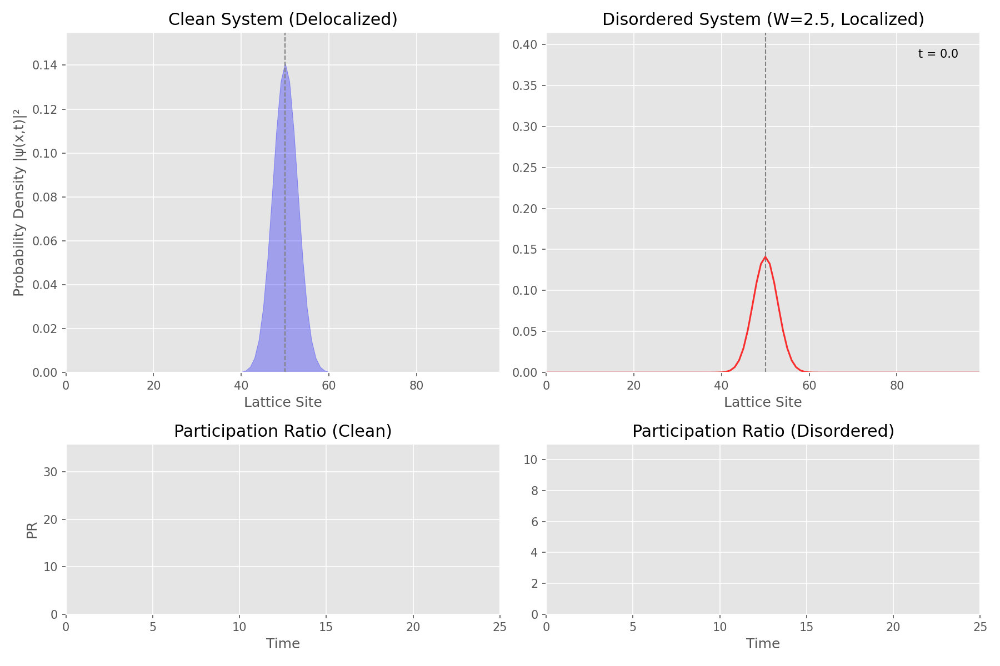

# Anderson Localization and the Anderson Transition

## A Simplified Demonstration of Quantum Localization

---

## Introduction

### Context and Motivation

Anderson localization is a fundamental quantum phenomenon in which disorder in a material causes a particle's wave function to become confined to a limited region. This prevents the particle from spreading across the lattice, directly impacting transport properties such as electrical conductivity. First predicted by Philip W. Anderson in 1958, it remains a cornerstone in the study of disordered quantum systems.

Understanding localization provides insights into why certain materials act as insulators despite classical predictions and has applications in ultracold atoms, photonic crystals, and other wave systems.

---

### Localization vs. Transition

It is crucial to distinguish **localization** from the **Anderson transition**:

- **Localization**: The confinement of a particle’s wave function due to disorder. It occurs in 1D, 2D, and 3D systems, with the spatial extent determined by the disorder strength.
- **Anderson Transition**: A phase transition in 3D systems where, at a critical disorder strength, states shift from delocalized (metallic) to localized (insulating).

This simulation focuses on **1D localization**, where a true transition does not occur. Comparing a clean (disorder-free) system to a disordered one illustrates the fundamental concepts without the computational complexity of 3D simulations.

---

### Dimensionality Considerations

Dimensionality strongly influences localization behavior:

- **1D and 2D**: All states localize for any finite disorder; there is no Anderson transition.
- **3D and higher**: States are separated by a **mobility edge**, and a critical disorder strength $W_c$ exists. Below $W_c$, states remain extended; above $W_c$, states localize, producing a true Anderson transition.

In 3D, the critical disorder in the Anderson model is roughly $W_c \approx 16.5\,t$, where $t$ is the hopping parameter. Simulating 3D systems is computationally intensive because the Hamiltonian scales as $\sim N^3$ for a cubic lattice.

---

### Purpose of This Simulation

The simulation focuses on a **1D lattice** to:

- Demonstrate the **difference between clean and disordered systems**.  
- Visualize **probability density (PD)** and **participation ratio (PR)** over time.  
- Avoid the computational burden of 3D simulations while illustrating the **underlying cause: wave function localization**.

By varying disorder strength, the simulation allows exploration of how localization strengthens with disorder, even though it does **not capture a true Anderson transition**.

---

### Summary of Key Points

- **Localization** is the core effect; **transition** occurs only in higher dimensions.  
- **1D simulations** suffice to demonstrate localization educationally.  
- **Dimensionality matters**: 1D/2D → all states localized; 3D → Anderson transition possible.  
- **Probability density** and **participation ratio** are used to quantify and visualize localization.

---

## Theoretical Background

### Quantum Mechanics and Wave Function Propagation

In a perfect crystal, electrons or other quantum particles can spread ballistically due to coherent propagation. However, impurities or defects introduce **disorder**, which can interfere with this spreading.

Anderson demonstrated that in a disordered potential, interference can lead to **exponential decay** of the wave function from a central site:

$$
\psi(x) \propto e^{-|x - x_0| / \xi}
$$

where $\xi$ is the **localization length**, which decreases with increasing disorder. This localization suppresses transport and can turn a conductor into an insulator.

---

### Dimensionality and Localization

| Dimension | Behavior with Finite Disorder |
|-----------|-----------------------------|
| 1D        | All states localized       |
| 2D        | All states localized       |
| 3D        | Transition occurs at $W_c$ |

In 3D, below $W_c$, the system remains metallic (delocalized states); above $W_c$, the system becomes insulating (localized states). This highlights why **1D is sufficient for demonstrating localization**, while 3D is needed to explore the full Anderson transition.

---

### Connection to Conductivity

- **Delocalized states**: Contribute to electrical conductivity ($\sigma > 0$).  
- **Localized states**: Do not contribute ($\sigma = 0$).  

At finite temperatures, hopping or thermal activation may allow conduction, but **Anderson localization is fundamentally a zero-temperature, quantum interference effect**.

---

### Experimental Observations

Anderson localization has been observed in:

- Electron transport in disordered wires.  
- Light propagation in photonic crystals and random media.  
- Ultracold atoms in optical lattices with speckle disorder.  
- Acoustic waves in random scatterers.

These experiments validate theoretical predictions and demonstrate the universality of localization across wave systems.

---

## Simulation Model

### Hamiltonian

We use a **1D Anderson tight-binding model**:

$$
H = -t \sum_{\langle i,j \rangle} \left( c_i^\dagger c_j + c_j^\dagger c_i \right) + \sum_i \epsilon_i c_i^\dagger c_i
$$

Where:

- $(c_i^\dagger, c_i)$: Creation and annihilation operators at site $i$  
- $t$: Hopping amplitude  
- $\epsilon_i$: Random on-site energy uniformly distributed in $[-W/2, W/2]$

In site basis $|i\rangle$, the Hamiltonian is tridiagonal: off-diagonal elements $-t$, diagonal elements $\epsilon_i$.

---

### Key Metrics

#### Probability Density (PD)

$$
\text{PD}_i(t) = |\psi_i(t)|^2
$$

- Initial state: Gaussian wave packet:

$$
\psi_i(0) = \frac{1}{\sqrt{2\pi\sigma^2}} \exp\left( -\frac{(i - N/2)^2}{2\sigma^2} \right)
$$

Note: The normalization factor $\frac{1}{\sqrt{2\pi\sigma^2}}$ is appropriate for a continuous Gaussian but may not ensure $\sum_i |\psi_i|^2 = 1$ on a discrete lattice. In the code, normalization is handled numerically using QuTiP’s Qobj.unit() method to ensure proper normalization. For a discrete lattice, the theoretical normalization factor is approximately $(2\pi\sigma^2)^{-1/4}$.

- **Clean system ($W=0$)**: PD spreads ballistically.  
- **Disordered system**: PD remains localized near the center.

#### Participation Ratio (PR)

$$
PR(t) = \frac{1}{\sum_i \text{PD}_i^2}
$$

- Delocalized state: $PR \approx N$  
- Localized state: $PR \approx 1$ or order of $\xi$  

PR evolution over time distinguishes between spreading (clean) and localized (disordered) states.

---

## Simulation Implementation

### Overview

The simulation uses **QuTiP** to solve the time-dependent Schrödinger equation:

$$
i \hbar \frac{\partial \psi}{\partial t} = H \psi, \quad (\hbar = 1)
$$

Key steps:

1. **Parameter Setup**: lattice size $N=100$, hopping $t=1$, disorder $W=2.5$, Gaussian width $\sigma=4$, time step $dt=0.3$, total time $25$.  
2. **Initial State**: Gaussian wave packet centered at $N/2$.  
3. **Hamiltonians**: Clean ($W=0$) and disordered (random $\epsilon_i$).  
4. **Time Evolution**: Using `qutip.mesolve`.  
5. **Metrics Calculation**: PD and PR at each time step.  
6. **Visualization**: Animation with:
   - Top: PD plots (filled for clean, line for disordered).  
   - Bottom: PR vs. time, dynamically updating.

**Numerical stability note:**  
The time step `dt = 0.3` is chosen to balance **accuracy** and **computational efficiency**.  

- Smaller `dt` → more precise but slower.  
- Larger `dt` → faster but risks instability or loss of accuracy.  

---

### Code Structure

- **`SimulationParams`**: Dataclass holding all lattice and simulation parameters.  
- **`create_initial_state`**: Constructs Gaussian wave packet.  
- **`build_hamiltonian`**: Constructs tight-binding Hamiltonian with optional disorder.  
- **`evolve_probs`**: Evolves the state and computes PD.  
- **`participation_ratio`**: Computes PR from PD.  
- **`create_animation`**: Animates PD and PR over time.  
- **`setup_visualization`**: Prepares figure and axes, calls animation.  
- **`main`**: Runs the full simulation and optionally saves the animation.

---

### Timing Parameters

- `dt`: Time step between frames. Smaller `dt` → smoother animation but more computation.  
- `total_time`: Duration of the simulation.  
- `frames`: Calculated as `total_time / dt + 1` to include $t=0$.  

---

## Interpreting the Outputs

1. **Probability Density (PD)**:  
   - Clean: Gaussian spreads → delocalization  
   - Disordered: Wavefunction confined → localization

2. **Participation Ratio (PR)**:  
   - Clean: PR grows → wave spreads  
   - Disordered: PR saturates → limited number of occupied sites
  
>Note: The PR plots for clean and disordered systems use independent y-axis scales, set to 1.1 times the maximum PR value observed (e.g., ~33 for clean, ~11 for disordered with current parameters). For the clean system, PR grows toward ( N = 100 ) as the wave spreads, but finite simulation time (( T = 25 )) and initial Gaussian width (( \sigma = 4 )) limit it to ~30. For the disordered system, PR saturates around 10, reflecting localization over ~10 sites due to the initial spread and disorder (( W = 2.5 )).

These visualizations clearly demonstrate the **core physics of localization**.

---

## Limitations and Extensions

- 1D simulations: No true Anderson transition, only localization.

- 3D simulations: Needed to observe a real Anderson transition but computationally expensive.  

---

## References

1. P. W. Anderson, *Absence of Diffusion in Certain Random Lattices*, Phys. Rev. 109, 1492 (1958)  
2. E. Abrahams et al., *Scaling Theory of Localization: Absence of Quantum Diffusion in Two Dimensions*, Phys. Rev. Lett. 42, 673 (1979)  
3. A. Lagendijk, B. van Tiggelen, D. S. Wiersma, *Fifty Years of Anderson Localization*, Physics Today 62, 24 (2009)
4. N. Lambert, E. Giguère, P. Menczel, B. Li, P. Hopf, G. Suárez, M. Gali, J. Lishman, R. Gadhvi, R. Agarwal, A. Galicia, N. Shammah, P. Nation, J. R. Johansson, S. Ahmed, S. Cross, A. Pitchford, F. Nori, QuTiP 5: The Quantum Toolbox in Python, arXiv:2412.04705 (2024). <https://arxiv.org/abs/2412.04705>.  
QuTiP Documentation: <https://qutip.org>
